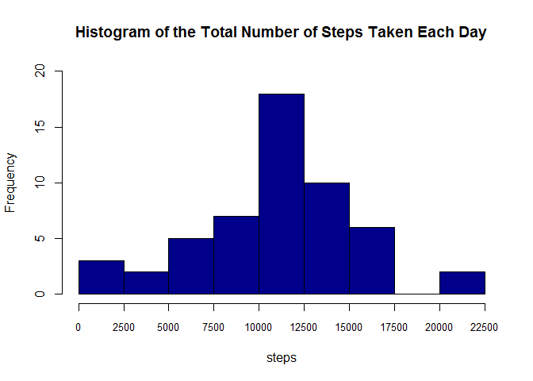
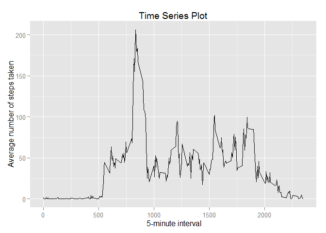
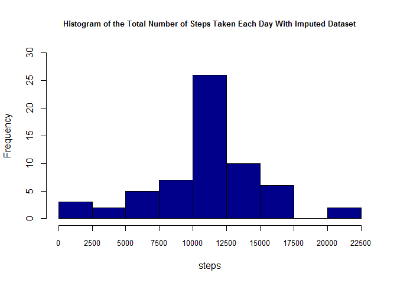

# Reproducible Research: Peer Assessment 1

## Loading and preprocessing the data


```r
Sys.setlocale("LC_TIME", "English")
activity<-read.csv("./activity.csv",header=TRUE)
activity_noNA<-na.omit(activity)
```

## What is mean total number of steps taken per day?

Here is a histogram of the total number of steps taken each day.

```r
# Calculate the total number of steps taken per day
stepperday<-aggregate(activity_noNA$steps,by=list(am=activity_noNA$date),sum)

# Make a histogram 
hist(stepperday$x,main="Histogram of the Total Number of Steps Taken Each Day",xlab="steps",col="darkblue",breaks=seq(0,22500,by=2500),ylim=c(0,20),xaxt = "n")
axis(1,seq(0,22500,by=2500),seq(0,22500,by=2500),cex.axis=0.8)
```

 


```r
# Mean and median
mean1<-format(mean(stepperday$x,na.rm=TRUE),digits=7)
median<-median(stepperday$x,na.rm=TRUE)
```

The mean of the total number of steps taken per day is 10766.19.
The median of the total number of steps taken per day is 10765.

## What is the average daily activity pattern?

Here is a time series plot of the 5-minute interval and the average number of steps taken, averaged across all days.

```r
# Caculate average number of steps taken per 5-minute interval
stepper5<-aggregate(activity_noNA$steps,by=list(am=activity_noNA$interval),mean)

# Time series plot 
library(ggplot2)
```

```
## Warning: package 'ggplot2' was built under R version 3.1.2
```

```r
g<-ggplot(stepper5,aes(am,x))
g+geom_line()+labs(title="Time Series Plot",x=" 5-minute interval",y="Average number of steps taken")+xlim(0,2355)
```

 


```r
# Return the interval which contains the maximum number of averaged step
maxinterval<-stepper5[which.max(stepper5$x),1]
```

The 835 interval contains the maximum number of averaged step.

## Imputing missing values


```r
# Calculate the total number of NAs
no_of_na<-sum(is.na(activity$steps))
```

The total number of missing values is 2304.
Here we impute NAs with the mean for that 5-minute interval.

```r
# Impute NAs with the mean for that 5-minute interval,save the results to a new dataframe named filled_activity
filled_activity<-activity
for(i in 1:nrow(activity)){
        if (is.na(filled_activity[i,1])){
            filled_activity[i,1]<-stepper5[which(stepper5$am==
            filled_activity[i,3]),2]
            }
}
```

Here is a histogram of the total number of steps taken each day with the imputed dataset.

```r
# Calculate the total number of steps taken per day with the imputed dataset
filled_stepperday<-aggregate(filled_activity$steps,by=list(date=filled_activity$date),sum)

# Make a histogram 
hist(filled_stepperday$x,main="Histogram of the Total Number of Steps Taken Each Day With Imputed Dataset",xlab="steps",col="darkblue",breaks=seq(0,22500,by=2500),ylim=c(0,30),xaxt = "n",cex.main=0.8)
axis(1,seq(0,22500,by=2500),seq(0,22500,by=2500),cex.axis=0.8)
```

 


```r
filled_mean<-format(mean(filled_stepperday$x),digits=7)
filled_median<-format(median(filled_stepperday$x),digits=7)
```

The mean and median total number of steps taken per day with the imputed dataset are respectively 10766.19 and 10766.19.The median value changes but the mean does not change.

## Are there differences in activity patterns between weekdays and weekends?


```r
# Create a new dataframe with a factor variable indicating whether a given date is a weekday or weekend day
filled_activity<-transform(filled_activity,date=as.Date(date))
w<-c()
for(i in 1:nrow(filled_activity)){
        if (weekdays(filled_activity[i,2])=="Saturday" ||weekdays(filled_activity[i,2])=="Sunday") {w<-c(w,"weekend")}
        else{w<-c(w,"weekday")} 
}
weekdata<-cbind(filled_activity,w)
```

Here is a panel plot 

```r
# Caculate average number of steps taken per 5-minute interval
filled_stepper5<-aggregate(weekdata$steps,by=list(w=weekdata$w,interval=weekdata$interval),mean)
# create a panel plot
library(lattice)
xyplot(x~interval|w,data=filled_stepper5,layout=c(1,2),xlab="Interval",ylab="Number of steps",type="l",lwd=1.4)
```

 
